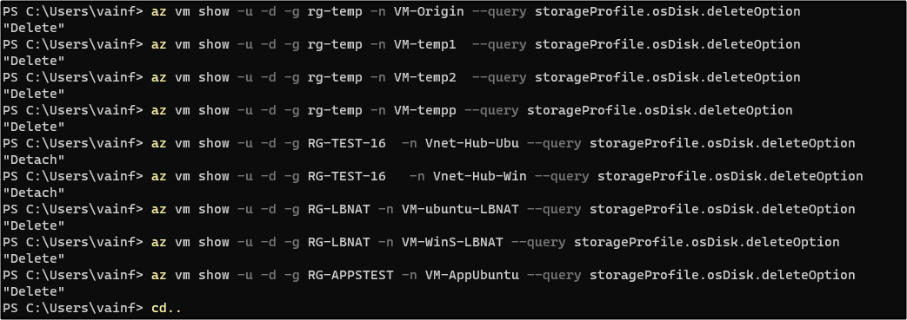

このスクリプトは、Azure CLI（Azure Command-Line Interface）を使用して、Azure仮想マシンの情報を取得しています。各コマンドは az vm show を使用し、指定したリソース グループと仮想マシンの名前から、特定の情報を問い合わせています。

ただし、最後の行には PowerShell のコードが混ざっています。具体的には、Read-Host -Prompt "Script Done! Press Enter to exit" は、スクリプトの実行が完了した後にユーザーに対して「Enter キーを押してスクリプトを終了してください」というプロンプトを表示するための PowerShell コマンドです。

各行の意味を簡単に説明します：

仮想マシン "VM-AppUbuntu" の OS ディスクの削除オプションを取得する。
仮想マシン "VM-ubuntu-LBNAT" の OS ディスクの削除オプションを取得する。
仮想マシン "VM-WinS-LBNAT" の OS ディスクの削除オプションを取得する。
仮想マシン "VM-Origin" の OS ディスクの削除オプションを取得する。
仮想マシン "VM-temp1" の OS ディスクの削除オプションを取得する。
仮想マシン "VM-temp2" の OS ディスクの削除オプションを取得する。
仮想マシン "VM-tempp" の OS ディスクの削除オプションを取得する。
仮想マシン "Vnet-Hub-Ubu" の OS ディスクの削除オプションを取得する。
仮想マシン "Vnet-Hub-Win" の OS ディスクの削除オプションを取得する。
PowerShell コード: ユーザーにスクリプトが完了したことを知らせ、Enter キーを押して終了するように促す。

以下サンプル画面
