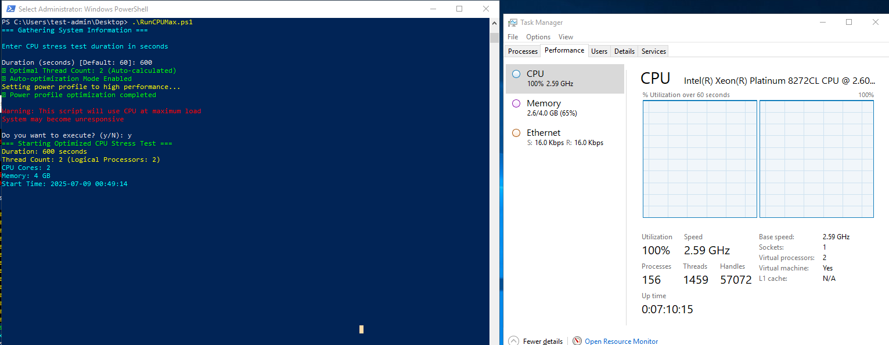

# RunMaxCPUStress.ps1

> 作成者: yamapan  
> ライセンス: MIT License  
> 日本語・英語両対応

## 概要

`RunMaxCPUStress.ps1` は、Windows 上で CPU に最大負荷をかけるための PowerShell スクリプトです。  
自動で最適なスレッド数や電源プロファイルを設定し、CPU ストレステストを安全かつ効率的に実施できます。  
日本語・英語の自動切り替えに対応しています。

## 主な機能

- 実行時間・スレッド数の自動最適化（手動指定も可）
- 電源プロファイルの高性能化
- CPU・メモリ・アーキテクチャ情報の表示
- 進捗・CPU 使用率のリアルタイム表示
- スレッドごとの実行回数集計（詳細表示時）
- 多言語対応（日本語/英語）

## 使い方

### 基本コマンド

```powershell
# 例: 60秒間、最適スレッド数でCPUストレステストを実行
.\RunMaxCPUStress.ps1
```

### 主なパラメータ

- `-DurationSeconds <秒数>`  
  テスト実行時間（秒）。省略時は対話式で入力。
- `-ThreadCount <数値>`  
  使用スレッド数。省略時は自動最適化。
- `-AutoOptimize`  
  電源プロファイル自動最適化（デフォルト: 有効）。
- `-ShowDetails`  
  システム詳細やスレッドごとの実行回数を表示。

#### 例: 120 秒・8 スレッド・詳細表示

```powershell
.\RunMaxCPUStress.ps1 -DurationSeconds 120 -ThreadCount 8 -ShowDetails
```

## 注意事項・実用 Tips

- **本スクリプトは CPU を最大負荷で使用します。**  
  実行中はシステムが一時的に応答しなくなる場合があります。重要な作業中は実行しないでください。
- 仮想環境やクラウド VM でのベンチマークにも利用可能ですが、リソース制限に注意してください。
- 管理者権限での実行を推奨します（電源プロファイル変更のため）。
- テスト後は電源プロファイルが元に戻ることを確認してください。

## 参考

- PowerShell のジョブ機能や`powercfg`コマンドを活用しています。
- 詳細なロジックやパラメータはスクリプト内コメントを参照してください。

## 実行例（参考画面ショット）

以下は実行時の PowerShell 画面とタスクマネージャの例です。



- 左: PowerShell での対話・実行画面
- 右: タスクマネージャで CPU が 100%使用されている様子

---

公式ドキュメント:

- [PowerShell ジョブ](https://learn.microsoft.com/ja-jp/powershell/scripting/learn/deep-dives/everything-about-jobs)
- [powercfg コマンド](https://learn.microsoft.com/ja-jp/windows-hardware/design/device-experiences/powercfg-command-line-options)
