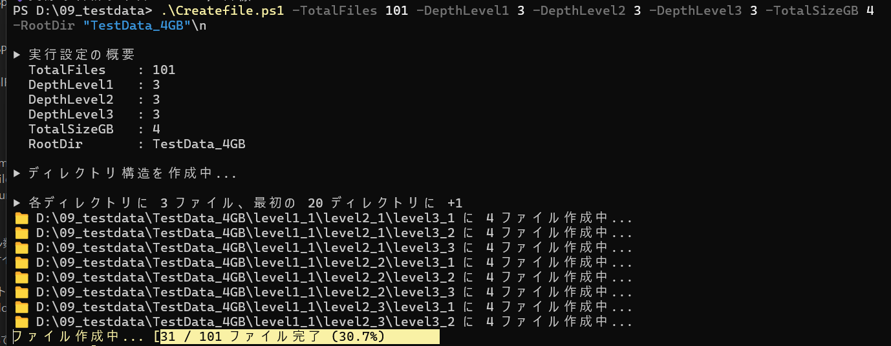
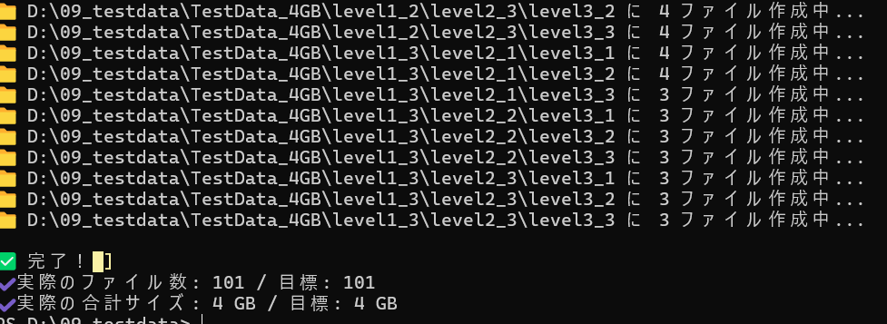

# 📁 PowerShell：ランダムファイル生成ツール

## 🧩 機能概要

このスクリプトは、指定された**ファイル数・サイズ・ディレクトリ階層構造**に基づき、暗号論的ランダムデータを持つバイナリファイルを自動生成します。性能検証やバックアップ/転送試験、アンチウイルス検査などのテストデータ生成に最適です。

- 指定したファイル数・サイズのランダムバイナリファイルを自動生成
- 任意のディレクトリ階層（3段）構成
- 暗号論的乱数を使用したランダムデータ
- ディスク容量検証やI/O性能試験に最適

---
## SCREEN SHOT




## 🚀 特徴

- ✔️ 対話形式 or パラメータ指定で動作可能（柔軟性あり）
- ✔️ 最大3階層のディレクトリ構造を自動作成
- ✔️ 暗号論的乱数によるランダムファイルの生成
- ✔️ 合計サイズとファイル数を均等に分配
- ✔️ 最終的なサイズ/件数を検証して出力

---

## 📂 生成される構成例

```plaintext
RootDir/
└── level1_1/
    └── level2_1/
        └── level3_1/
            ├── file_001
            ├── file_002
            └── ...
```

> ※ ディレクトリ数は `DepthLevel1 × DepthLevel2 × DepthLevel3` によって決定されます。ファイルはすべて最下層（level3）に作成されます。

---

## ⚙️ 使用方法

### ▶ 実行

```powershell
.\TestDataGen_rand.ps1
```

### ▶ 実行中の選択肢

- 入力されていないパラメータは `Read-Host` によって対話的に補完されます。
- 入力値を省略すると、以下の **デフォルト値** が適用されます。

---

## 🧾 パラメータ一覧

| パラメータ名     | 型        | 説明                                                                             | 例            | デフォルト値 |
|------------------|-----------|----------------------------------------------------------------------------------|---------------|--------------|
| `TotalFiles`     | `[int]`   | 全体で生成するファイルの数                                                       | `1000`        | `100`        |
| `DepthLevel1`    | `[int]`   | 第1階層のディレクトリ数（`level1_*`）                                            | `3`           | `3`          |
| `DepthLevel2`    | `[int]`   | 第2階層のディレクトリ数（`level2_*`）                                            | `3`           | `3`          |
| `DepthLevel3`    | `[int]`   | 第3階層のディレクトリ数（`level3_*`）                                            | `3`           | `3`          |
| `TotalSizeGB`    | `[int]`   | 全ファイルの合計サイズ（GB単位）                                                | `100`         | `180`        |
| `RootDir`        | `[string]`| ファイルを作成するルートディレクトリのパス                                       | `testfileset` | `"dataroot"` |

---

## 実行例
```.\Createfile.ps1 -TotalFiles 101 -DepthLevel1 3 -DepthLevel2 3 -DepthLevel3 3 -TotalSizeGB 16 -RootDir "TestData_16GB"```

| 引数名            | 型   | 値                | 説明                                                                                          |
| -------------- | --- | ---------------- | ------------------------------------------------------------------------------------------- |
| `-TotalFiles`  | int | 101              | 作成するファイルの総数。全体で16GBとなるよう、各ファイルサイズは `16GB ÷ 101`（約169MB/個）になるよう分割されます。                       |
| `-DepthLevel1` | int | 3                | ディレクトリの**第1階層**に作成されるディレクトリ数。例: `level1_1`, `level1_2`, `level1_3`。                         |
| `-DepthLevel2` | int | 3                | 第2階層ディレクトリの数。`level1_*/level2_*` のように配置。                                                    |
| `-DepthLevel3` | int | 3                | 第3階層ディレクトリ（ファイルが作られる場所）の数。`level1_*/level2_*/level3_*` と連結して **合計 3×3×3=27個のディレクトリ**が作られます。 |
| `-TotalSizeGB` | int | 16               | 作成する全ファイルの合計サイズ（GB）。ファイルごとに均等に割り当てられます。                                                     |
| `-RootDir`     | str | "TestData\_16GB" | 作成されるディレクトリ構造のルートディレクトリ名。ここを起点に階層が展開されます。                                                   |


## 🏗️ 処理の仕組み

1. **変数定義・デフォルト補完**：
   - `$param()`ブロックで未入力の場合、対話的に補完
2. **サイズ計算**：
   - `TotalSizeGB ÷ TotalFiles` により1ファイルあたりのバイト数を計算
3. **ディレクトリ作成**：
   - `level1_x\level2_y\level3_z` 形式の3階層を自動生成
4. **ディレクトリ取得・ファイル分配**：
   - `Get-ChildItem` によって `level3_*` ディレクトリを抽出し、
   - 均等にファイルを分配（余りは先頭から順に+1）
5. **ファイル生成**：
   - `RandomNumberGenerator.Fill()` により暗号論的バイナリを生成
   - `.WriteAllBytes()` で保存

---

## ✅ 出力結果

実行終了時、以下の内容が確認できます：

- 実際に作成されたファイル数
- 実際の合計サイズ（GB）
- 目標値との差分

---

## 📌 注意事項

- 大量データ生成により、ディスク容量を圧迫する恐れがあります
- ファイルサイズ・総数の調整により生成時間が大きく変動します
- ファイルの内容は完全ランダムです（圧縮や差分検出に不利な構成）


## ▶️ 使用方法

```powershell
.\Generate-RandomFiles.ps1
